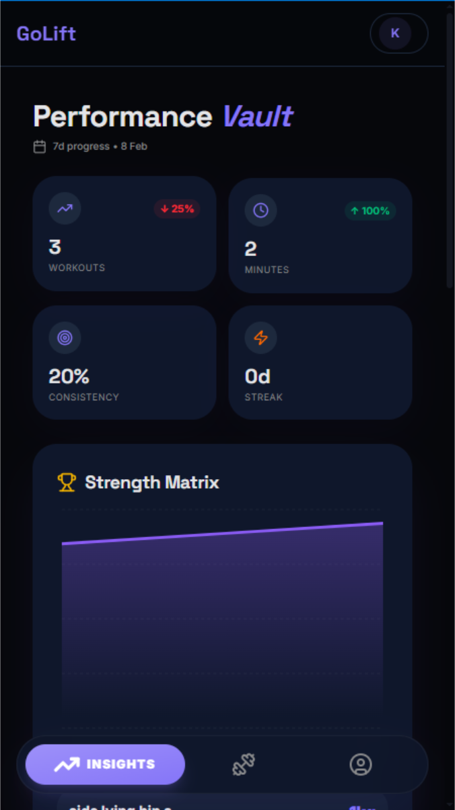
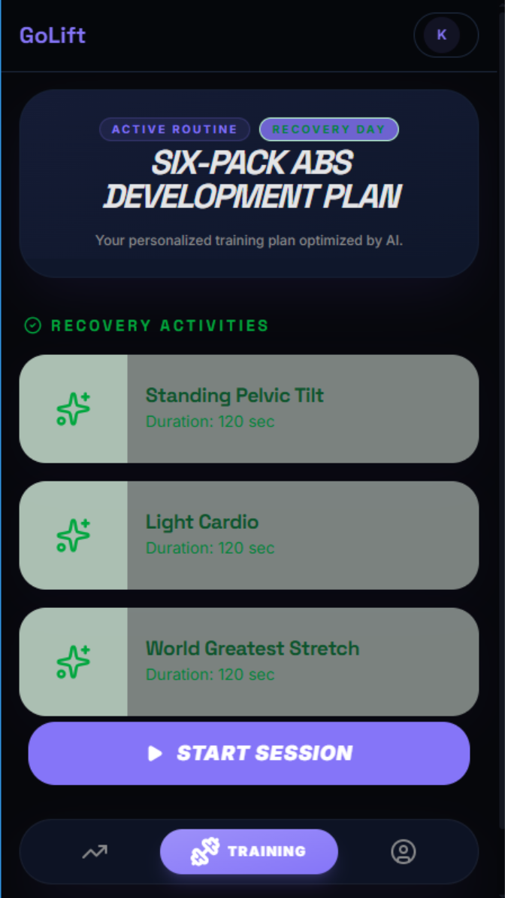
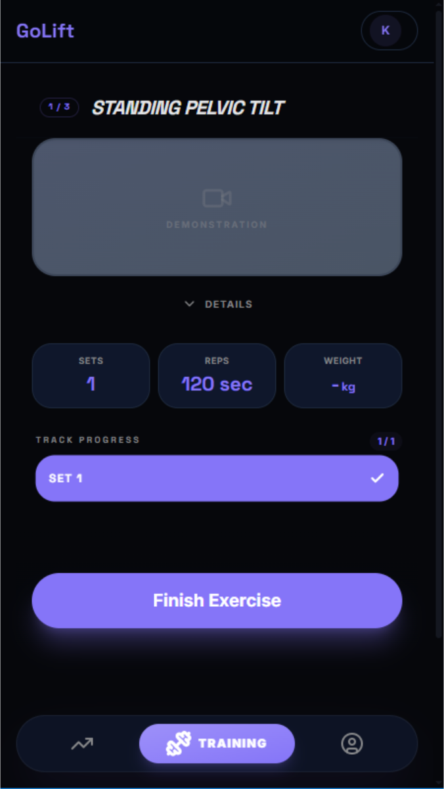
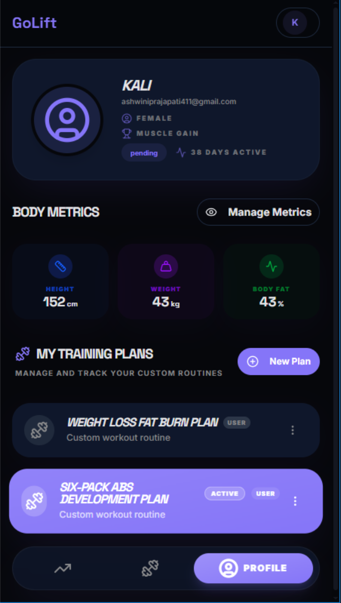
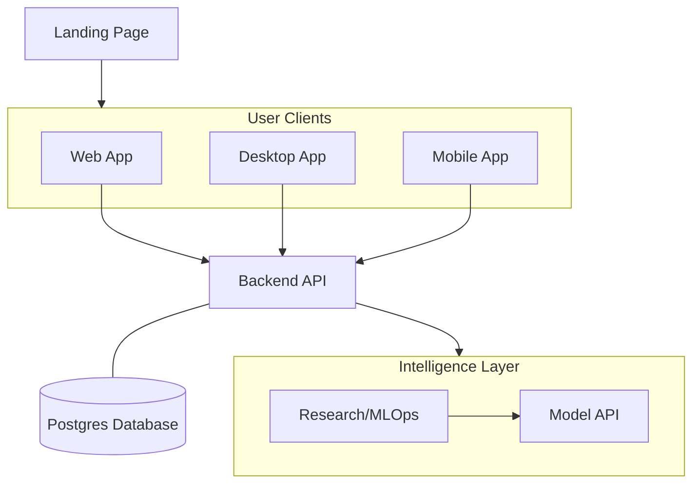
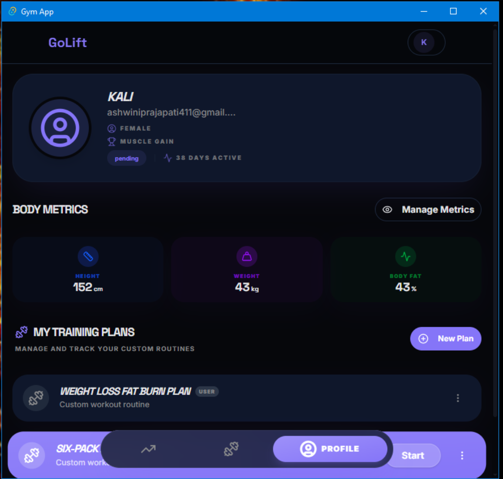

# 🏗️ GoLift Ecosystem 🏋️‍♂️

Welcome to the **GoLift** project — a professional, AI-powered health and fitness platform designed for high-performance training tracking and personalized workout generation.

The GoLift ecosystem consists of several specialized modules working in harmony to provide a seamless experience across Web, Desktop, Mobile, and Native environments.

---

## 🚀 The Vision
GoLift aims to simplify fitness progression by leveraging data-driven insights and a premium user interface. From elite athletes to beginners, GoLift provides the tools to track, analyze, and optimize every rep.

*Data-driven insights for high-performance training.*

---

## 🛠️ Project Modules

The repository is organized into distinct sub-projects, each with its own dedicated documentation and tech stack:

| Module | Role | Technology Stack |
| :--- | :--- | :--- |
| **[Backend](./backend)** | Core API & Logic | FastAPI, PostgreSQL, SQLModel |
| **[Frontend](./frontend)** | Web Application | React 19, Vite 7, Tailwind 4 |
| **[Desktop](./desktop)** | Desktop Suite | Tauri v2 (Rust + React) |
| **[Landing](./landing)** | Marketing Page | Next.js 15, Framer Motion |
| **[MLOps](./mlops)** | Intelligence Engine | Python, Scikit-learn, MLFlow |
| **[Mobile](./phone/GoLiftApp)** | Native Application | React Native 0.84, TypeScript |

  
  
  

<i>Seamless experience across all platforms.</i>

---

## 📐 Ecosystem Architecture

GoLift is built on a modern, decoupled architecture designed for scale:

---

## 🎨 Design Language
The entire ecosystem adheres to a unified design system to ensure a premium, premium experience:
- **Colors**: Modern dark mode with OKLCH-based gradients.
- **Typography**: Space Grotesk (Headings) and Inter (Body).
- **Aesthetics**: Glassmorphism, smooth animations, and responsive layouts.

*Unified premium aesthetic across the GoLift Desktop suite.*

---

## 🛠️ Local Development

To get the entire ecosystem running, please follow the setup guides in each module's respective directory. A typical workflow involves:
1. **Starting the Backend**: Initialize the database and FastAPI server.
2. **Running the Frontend**: Launch the Vite development server.
3. **Exploring the Clients**: Open the Web, Desktop (Tauri), or Mobile (React Native) applications.

For detailed instructions, refer to:
- **[Backend Setup](./backend/README.md#local-development-setup)**
- **[Frontend Setup](./frontend/README.md#environment-setup)**
- **[Desktop Setup](./desktop/README.md#local-development-setup)**
- **[Landing Setup](./landing/README.md#environment-setup)**
- **[Mobile Setup](./phone/GoLiftApp/README.md#local-development-setup)**
- **[MLOps Setup](./mlops/README.md#setup-instructions)**

---

## 📜 Development Status
GoLift is currently in **active development**. While the core infrastructure (Web, Backend, Desktop) is stable, the MLOps engine and specific Native Mobile features are in the research and prototyping phases.

---

*Built with ❤️ for the fitness community.*
