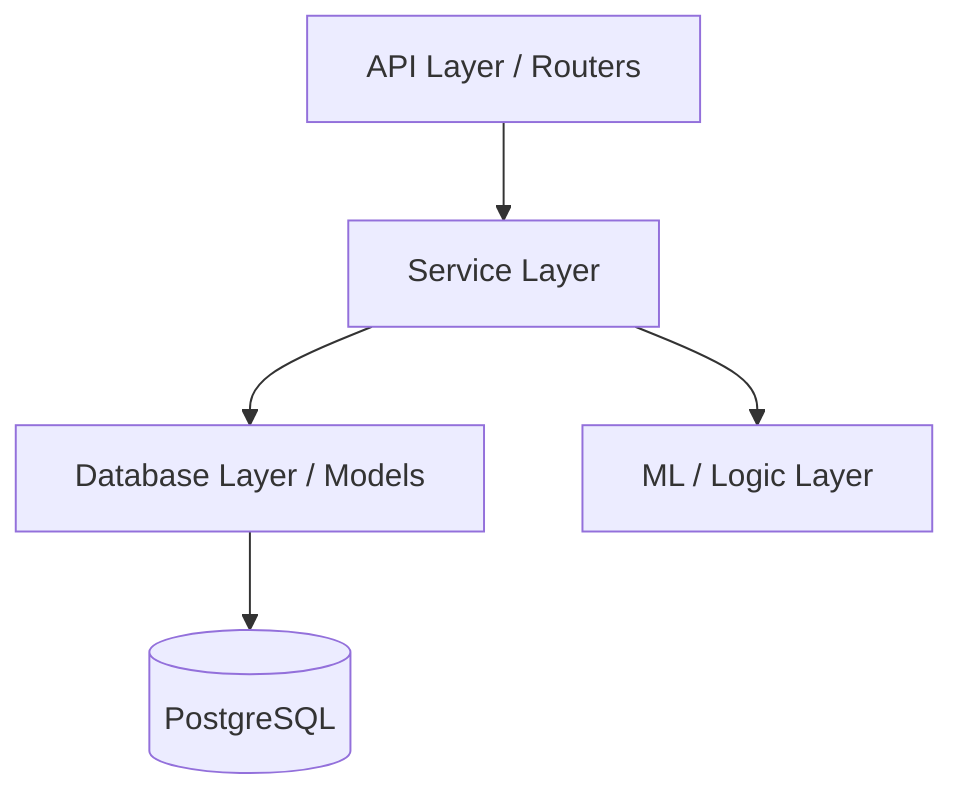

# 🚀 GoLift Backend

A high-performance, professional fitness backend system built with **FastAPI**, **PostgreSQL**, and **AI-driven insights**. GoLift provides a robust platform for managing workout plans, tracking progress, and generating personalized exercise recommendations.

---

## 1. Project Overview
GoLift Backend is designed to bridge the gap between static workout tracking and dynamic, AI-pushed fitness progression. It handles:
- **User Lifecycle**: From secure registration to detailed profile management.
- **Workout Logic**: Flexible templates, user-customizable plans, and session tracking.
- **AI Insights**: (In progress) Leveraging machine learning to recommend the best workout paths based on user history and goals.
- **Security**: Enterprise-grade authentication and data privacy.

---

## 2. Technology Stack
- **Framework**: [FastAPI](https://fastapi.tiangolo.com/) (Async Python)
- **Database**: [PostgreSQL](https://www.postgresql.org/) with [SQLAlchemy](https://www.sqlalchemy.org/) (ORM)
- **Migrations**: [Alembic](https://alembic.sqlalchemy.org/)
- **Authentication**: JWT (JOSE), OAuth2, Google Auth support
- **ML/Data**: NumPy, Pandas, Scikit-learn, MLFlow
- **Logging**: Loguru
- **Environment Management**: [uv](https://github.com/astral-sh/uv), python-dotenv

---

## 3. Backend Architecture
The system follows a **Modular Layered Architecture**:



- **API Layer (`app/router`)**: Handles HTTP requests, validation (Pydantic), and documentation.
- **Service Layer (`app/services`)**: Contains core business logic, orchestrating between the database and utility layers.
- **Database Layer (`app/database`)**: Defines data models and handles session management.
- **ML Layer (`app/ml`)**: Dedicated logic for workout recommendations and performance analysis.

---

## 4. Folder Structure

```text
backend/
 ├── app/
 │   ├── api/            # Route endpoint logic
 │   ├── core/           # Config, security, and global exceptions
 │   ├── database/       # Models and connection management
 │   ├── ml/             # ML models and recommendation logic
 │   ├── router/         # API Route definitions (v1)
 │   ├── schemas/        # Pydantic data validation models
 │   ├── services/       # Business logic / Service layer
 │   └── utils/          # Helper functions
 ├── alembic/            # Database migration scripts
 ├── logs/               # Application log files
 ├── main.py             # FastAPI entry point
 ├── run.py              # Server run script
 ├── pyproject.toml      # Dependency management (uv)
 └── makefile            # Handy automation commands
```

---

## 5. API Documentation
The API is versioned (`/v1`) and documented via Swagger. Below are the key endpoints:

| Category | Method | Path | Description |
| :--- | :--- | :--- | :--- |
| **Auth** | `POST` | `/v1/auth/login` | Login and get JWT |
| **User** | `GET` | `/v1/users/me` | Current user profile |
| **Workout**| `POST` | `/v1/workout/generate` | Generate AI workout |
| **Session**| `POST` | `/v1/session/complete`| Finish active session |

> Detailed documentation is available at `/docs` (Swagger UI) or `/redoc` when the server is running.

---

## 6. Database Design
GoLift uses a relational schema optimized for workout history and user progression.
- **Users**: Core account data and authentication.
- **UserProfiles**: Physical metrics, goals, and experience levels.
- **WorkoutTemplates**: Predefined professionally curated plans.
- **UserWorkoutPlans**: Active plans assigned to users (supports 'temp', 'ml', or 'user' sources).
- **WorkoutSessions**: Real-time tracking of started/completed workouts.

---

## 7. System Design Overview
1.  **Request Flow**: Requests are intercepted by CORS middleware, then routed to specific API controllers.
2.  **Auth Check**: Protected routes require a valid Bearer Token validated via `app/core/security.py`.
3.  **Processing**: The Service Layer fetches required data, performs calculations (or ML inference), and prepares the response.
4.  **Persistence**: Changes are committed to PostgreSQL using SQLAlchemy's Unit of Work pattern.

---

## 8. Environment Setup

### Prerequisites
- Python 3.14+
- `uv` (Recommended) or `pip`
- PostgreSQL

### Installation
```bash
# Clone the repository
git clone <repo-url>
cd backend

# Create virtual environment and install dependencies
uv venv
uv sync

# Setup environment variables
cp .env.example .env  # Fill in your database and secret keys
```

### Running the Server
```bash
# Using Makefile
make dev

# Or directly
uv run uvicorn app.main:app --reload
```

---

## 9. Security Features
- **JWT Authentication**: Secure stateless sessions with access & refresh tokens.
- **Password Hashing**: Bcrypt / Argon2-cffi.
- **CORS Management**: Fine-grained control over allowed origins (Tauri, Web, Mobile).
- **Role-Based Access**: Support for `member`, `trainer`, and `admin` roles.

---

## 10. Testing
Run the test suite using `pytest`:
```bash
make test
```
Tests are located in `app/test/` and cover API endpoints and core service logic.

---

## 11. Deployment
For production environments:
```bash
make prod
```
Configured for easy containerization. Ensure `DATABASE_URL` is set to your production instance.

---

## 12. Future Improvements
- [ ] Integration with Wearable SDKs.
- [ ] Advanced ML models for injury prevention.
- [ ] Real-time trainer-client chat integration.
- [ ] Full Docker Compose orchestration for easy scaling.
