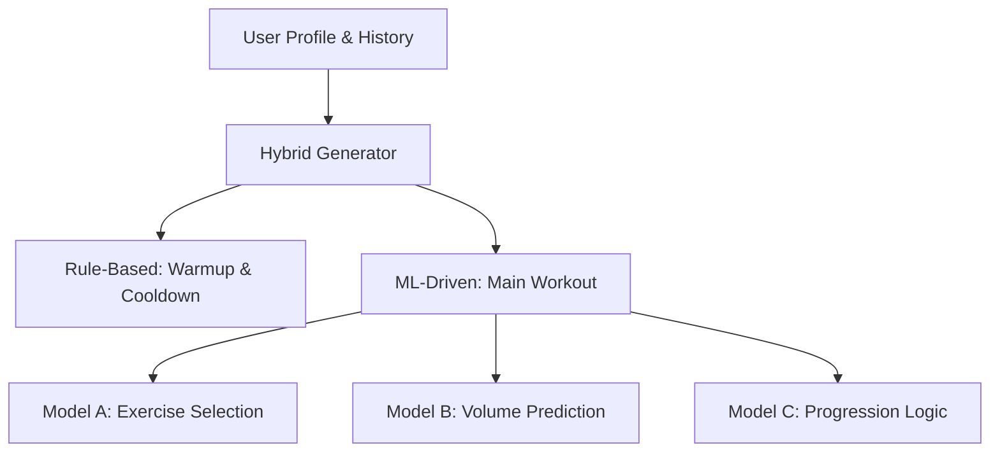

# 🧠 GoLift MLOps

The intelligence engine of the GoLift ecosystem. This repository manages the research, development, and deployment of machine learning models that power personalized workout recommendations and performance-based progression.

---

## 🏗️ Current Development Status
> [!IMPORTANT]
> This project is currently under active development. We are in the **Research & Prototyping phase**, focusing on building the MVP for volume prediction.

### Roadmap Checklist
- [x] **Research & Analysis**: Baseline data exploration and normalization logic.
- [x] **System Design**: Defined the 3-model Hybrid Architecture.
- [/] **Volume Prediction MVP**: Feature engineering and initial regression models (In Progress).
- [ ] **Experiment Tracking**: Integration with MLFlow (Planned).
- [ ] **Pipeline Orchestration**: Automated workflows with Apache Airflow (Planned).
- [ ] **Production Deployment**: FastAPI-based inference service (Planned).

---

## 🛠️ Technology Stack
- **Languages**: Python 3.x
- **ML Frameworks**: Scikit-learn, XGBoost (Planned)
- **Data Processing**: Pandas, NumPy
- **Environment**: Jupyter Notebooks (for research)
- **Planned Infrastructure**:
  - **Experiment Tracking**: MLFlow
  - **Orchestration**: Apache Airflow / Astronomer
  - **Deployment**: Docker & FastAPI
  - **Logging**: Custom Python Logger

---

## 📐 Application Architecture
GoLift uses a **Hybrid System** combining rule-based safety with ML-driven personalization:



### The Three Pillars
1.  **Exercise Selection**: Ranking exercises based on user goals, equipment, and history.
2.  **Volume Prediction (MVP Focus)**: Predicting the optimal number of sets and reps using regression.
3.  **Progression Logic**: Deterministic and learnable adjustments based on RPE (Rate of Perceived Exertion) and completion rates.

---

## 📂 Repository Structure

```text
mlops/
 ├── research/         # Active experimentation and notebooks
 │   ├── data/         # Raw and processed research datasets
 │   ├── notebooks/    # Jupyter notebooks for model prototyping
 │   ├── mlops_note.txt# Technical debt and setup notes
 │   └── my_model_plan.md # Strategic architectural plan
 ├── model/            # (Planned) Serialized model artifacts (.pkl, .onnx)
 ├── src/              # (Planned) Production-ready scripts
 │   ├── training/     # Model training pipelines
 │   ├── inference/    # Real-time prediction logic
 │   └── utils/        # Shared helper modules
 └── requirements.txt  # Project dependencies
```

---

## 🔄 ML Pipeline Flow
1.  **Ingestion**: Extracting anonymized performance data from the GoLift database.
2.  **Preprocessing**: Normalizing workout logs (reps, weight, RPE).
3.  **Feature Engineering**: Calculating rolling averages, fatigue indicators, and progression rates.
4.  **Training**: Training regression models (Linear/XGBoost) for volume prediction.
5.  **Evaluation**: Validating against historical progression data.

---

## 🚀 Future Roadmap
- **Automated Retraining**: Weekly model updates based on fresh user feedback loops.
- **Monitoring**: Performance drift detection and data quality alerts.
- **Model Registry**: Versioning models and managing stage transitions (Staging -> Production).
- **Advanced Recommenders**: Transitioning from scoring systems to collaborative filtering for exercise selection.


